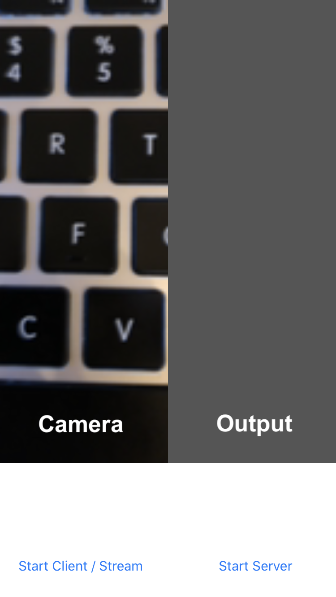
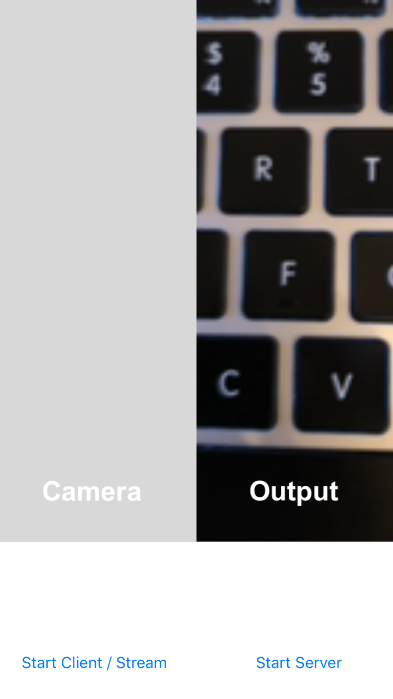

# Reproduced demo from WWDC 2018 _"Introducing Network.framework: A modern alternative to Sockets"_

## Description

It is a sample app using **Network.framework** similar to that shown on [WWDC 2018](https://developer.apple.com/videos/play/wwdc2018/715/). It uses no dependencies and no external server. The streaming is done locally. The same app could be a server or a client at the same time. It potentially could work with any platform.

So it must be possible to implement video streaming for such directions, for example:

- iOS <-> iOS
- iOS <-> Android

## Instructions

1. Download the project
2. Sign it (since you need to launch it on your real device with a camera)
3. Add to the `Constants` the name of the server device (Could be found: _System Preferences -> Sharing -> Computer Name_ on macOS; _Settings -> General -> About -> Name_ on iOS; in the console when running)
4. Launch apps on different devices: in the first start a server, then in second start a client and streaming
6. The left part of the screen is a camera of one device, the right part is the output from the other device
5. Xcode console is your friend

## Further considerations

- Implement better compression
- Add audio and synchronize with video
- Increase the size of a UDP packet (by default 2000)

## NOTES

- Not all errors are handled correctly
- Now the client sends only frames that are one-colored or just of very low size

## License

[MIT](https://github.com/ilyagru/networklocalstreaming/blob/master/LICENSE)
